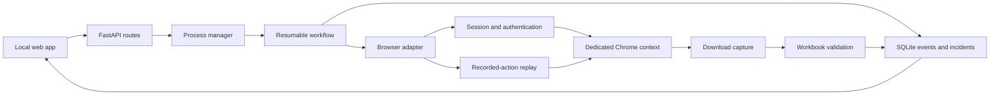

# G-MES Automation Engineering Report

**Project:** SmartOps / Computer Use  
**Report date:** 2026-09-06  
**Timezone:** Africa/Cairo  
**Status:** Engineering pilot; not approved for production or unattended scheduling  
**Scope:** Experience recovered from the previous Codex session, repository review, local web-app demonstration, one controlled replay attempt, focused tests, and open-source architecture research

## Executive summary

SmartOps has a strong local foundation for recording and replaying browser work: a FastAPI control plane, Playwright browser adapter, resumable workflow records, SQLite event history, evidence capture, credential references, and download validation. A real G-MES recording reached the Excel download and produced a structurally valid workbook. This proves that the report path and the capture model can work.

The complete unattended journey is **not yet proven**. The latest controlled replay failed during automatic authentication while trying to follow the signed-in G-MES tab. The G-MES message reported by the operator—"already open in background"—is consistent with a Chrome profile or browser ownership conflict, but the available evidence does not prove one single cause. Several related defects and design gaps can produce the same symptom.

The most important conclusion is:

> Do not redesign the Excel extraction yet. First make Chrome ownership, profile isolation, extension availability, and post-login page identity deterministic.

The safest near-term architecture remains Python + Playwright + SQLite, with SmartOps owning policy, evidence, validation, and recovery. External projects such as Stagehand, Browser Use, Skyvern, Prefect, Windmill, Temporal, and OpenHands should be evaluated behind adapters only when a measured problem justifies them. SmartOps should coordinate specialized engines; it should not attempt to rebuild every engine itself.

## What this report does and does not contain

This report contains:

- The reconstructed engineering timeline.
- What was actually demonstrated.
- Problems encountered, their root causes where known, and the fixes applied.
- Current blockers, separated into verified facts and hypotheses.
- Test and database evidence.
- Security boundaries and repository hygiene risks.
- A gated continuation plan and production definition of done.

This report intentionally excludes:

- Credentials, usernames, cookies, tokens, and Windows Credential Manager values.
- Corporate URLs, internal endpoint names, and captured page content.
- Private profile locations, traces, screenshots, downloads, and company data.
- Any claim that a fixture test proves the real corporate SSO path.

## Status vocabulary

The following labels are used throughout the report:

| Label | Meaning |
|---|---|
| **Verified** | Directly observed in a run, test, database record, or inspected implementation. |
| **Implemented** | Code exists, but the real target environment has not validated it. |
| **Hypothesis** | Plausible explanation supported by related evidence, but not yet isolated experimentally. |
| **Blocked** | A required acceptance condition is not satisfied. |
| **Proposed** | Recommended future work; it has not been implemented. |

## Project intent and engineering principles

SmartOps is intended to be a local-first operational automation platform. For the G-MES pilot, the desired journey is:

1. Record the business workflow safely.
2. Convert the recording into a reviewable process.
3. Replay it with deterministic browser control.
4. Validate the downloaded workbook.
5. Store events and evidence for every meaningful step.
6. Recover or resume after interruption.
7. Approve only after controlled testing.
8. Schedule only after repeated success.

The repository rules correctly establish the automation ladder:

> Network/API first, then DOM, then Vision, then Desktop.

This ordering matters. Network and DOM strategies are faster and easier to validate. Vision and desktop control are valuable fallbacks, but they must be bounded and must not replace evidence-based selectors when a stable interface exists.

Every download must be treated as untrusted until validation confirms at least:

- A download event occurred.
- A non-empty file was saved.
- The file type and signature are consistent.
- The workbook opens successfully.
- Required sheets, columns, and row expectations pass.
- The output is registered against the run and can be audited.

## Current architecture



The replay route used by the web app is:

```text
Test button
  -> POST /api/processes/{process_id}/test
  -> ProcessManager.test()
  -> process.replay workflow
  -> replay_recording()
  -> PlaywrightBrowserAdapter.replay()
```

The approved Run route is a separate path and should not be used until testing and approval have passed.

## Reconstructed timeline

| Time | Outcome |
|---|---|
| 2026-09-05 | The baseline runnable process/replay journey, web-app rebuild, browser discovery changes, and recording lifecycle hardening were committed. |
| 2026-09-06, morning | Work expanded around the web UI, credential isolation, the Recording Coach, live recorder feedback, redaction, popup login, and proof capture. |
| 2026-09-06, early afternoon | G-MES recording and replay authentication were iterated, including persistent Chrome configuration and optional extension loading. |
| 2026-09-06, controlled recording | One G-MES recording completed with seven recorded steps and one Excel download. The workbook opened successfully and contained one sheet, 758 rows, and 19 columns. |
| 2026-09-06, restart test | SmartOps recovered an unfinished run, marked the unsafe interrupted step failed, and moved the related process to `test_failed`. This was correct fail-safe behavior. |
| 2026-09-06, live demo | The SmartOps web app was opened visibly in Chrome and exactly one controlled process test was started. |
| 2026-09-06, latest replay | The test failed during automatic login while following the signed-in G-MES tab. The process remained `test_failed`; no schedule was enabled. |
| 2026-09-06, diagnostics | A lightweight popup-login regression was found and fixed. Broader focused tests progressed but did not finish green. Chrome/profile and page-handoff design issues were identified. |

## What was actually proven

### Successful controlled recording

The strongest positive evidence is the completed recording:

| Evidence | Result |
|---|---|
| Recorded steps | 7 |
| Detected downloads | 1 |
| Saved file | Non-empty `.xlsx` workbook |
| Approximate size | 75 KB |
| Workbook open | Successful |
| Worksheets | 1 |
| Data rows | 758 |
| Columns | 19 |

This demonstrates that the user can navigate the G-MES report, trigger the export, and allow SmartOps to capture and validate the resulting workbook at recording time.

It does **not** demonstrate unattended replay. The database currently has no registered validated output in the final run-output registry, so the full process path from replay through registered result is still incomplete.

### Safe stale-run recovery

Before the web-app demonstration, an earlier process test remained marked `running` although no server or worker was active. On startup, recovery logic:

- Detected the stale run.
- Preserved its events.
- Refused to repeat an unsafe step.
- Marked the run failed.
- Moved the process to `test_failed`.

This is the desired safety behavior. Resumability does not mean blindly repeating actions; non-repeatable actions must stop for review.

### Latest controlled replay

The latest run began at approximately 15:44 Cairo time and ended about 82 seconds later. Its final classification was an authentication failure while attempting to identify or follow the signed-in application tab.

Important observations:

- Only one new process test was triggered.
- The failure was recorded in SmartOps rather than falsely reported as success.
- The process stayed unscheduled.
- No active SmartOps-controlled Chrome process remained when the process list was inspected afterward.
- The captured trace was too small and there was no useful sanitized screenshot for isolating the authentication stage.

Therefore, the reported background-open message was real operator evidence, but it did not correspond to a still-running SmartOps Chrome process at the later inspection point.

## Problems encountered and how they were handled

### 1. Browser launch logic was duplicated

**Problem:** Recording, replay, extraction, and login paths could launch browsers differently. This makes headed mode, persistent profiles, extensions, and session state inconsistent.

**Action taken:** A shared browser-session factory was introduced in `src/smartops/adapters/browser/session.py`. It centralizes Chrome channel selection, persistent-context launch, optional profile selection, extension paths, and ephemeral-context storage state.

**Status:** Implemented; fixture-tested. Real corporate Chrome behavior is not yet proven.

**Residual risk:** The factory currently exposes a conceptual conflict between an isolated user-data directory and a named corporate subprofile. This is a P0 issue described later.

### 2. Download handlers could miss pages or re-enter Playwright

**Problem:** A login or export can open a popup or replacement page. A listener registered only on the original page may miss the download. Saving the download directly inside an event callback can also create re-entrancy problems in Playwright.

**Action taken:** Download listeners were added to existing and future pages. Event callbacks queue download handles, and saving is performed outside the callback. Replay validates non-empty files and checks the expected download count.

**Status:** Implemented and supported by focused tests; the recording download succeeded. Unattended replay download remains unproven.

**Lesson:** Browser events should record intent quickly; substantial Playwright work should happen in the normal control flow.

### 3. Python sleeps blocked browser event processing

**Problem:** Plain blocking sleeps can prevent Playwright events and page state from being processed at the time they are needed.

**Action taken:** Browser paths were changed to Playwright-aware waits and event pumping where possible, including live recorder updates before Stop.

**Status:** Implemented. More timing tests are still needed around popup closure and tab replacement.

### 4. Dynamic Nexacro selectors were too brittle

**Problem:** G-MES uses generated identifiers and large composite elements. Literal selectors and absolute desktop coordinates do not survive layout or session changes.

**Action taken:** Selector handling was generalized for dynamic suffixes. For large browser elements, the recorder stores a point relative to the element bounds rather than an absolute screen coordinate. Replay reconstructs the point from the current element size.

**Status:** Implemented and locally covered. The real replay did not get far enough to validate these actions end to end.

**Lesson:** A relative point inside a verified DOM element is an acceptable bounded fallback; an absolute desktop coordinate is not.

### 5. A recording could previously appear complete without the business output

**Problem:** Stopping a recorder before an export could create a false impression of success.

**Action taken:** Recording completion now requires a detected download. Otherwise the recording is incomplete or failed, and the final event buffer is flushed before browser shutdown.

**Status:** Implemented. The successful recording met this condition.

### 6. Credential handling needed a stronger isolation boundary

**Problem:** Web forms, recordings, logs, screenshots, and agent context must never receive reusable secrets. Usernames can also be sensitive and should not be stored as ordinary typed values.

**Action taken:**

- Credentials are represented by references.
- Secret values are retrieved only when a browser field must be filled.
- The Windows credential flow uses a native prompt and Windows Credential Manager.
- Login is attempted once and is not automatically retried, reducing account-lock risk.
- Tracing is bounded around sensitive input.
- Recording redaction treats both username and password values as protected.
- The Recording Coach receives workflow structure only, not page content, selectors, URLs, screenshots, cookies, or downloads.

**Status:** Implemented with focused coverage. Real SSO completion is not proven.

### 7. Corporate SSO could pause under the debugger

**Problem:** Some SSO pages can execute debugger statements, leaving a popup visually paused and preventing the form from rendering.

**Action taken:** New pages use the Chrome DevTools Protocol to skip debugger pauses, with a bounded resume attempt for a page that paused before the event handler attached.

**Status:** Implemented. The mechanism matches the DevTools protocol, but it is not yet validated against the complete corporate flow.

### 8. Popup-login page enumeration rejected a valid page double

**Problem:** A focused popup-login test failed because `_open_pages` called `candidate.is_closed()` directly. A lightweight established page double without that method was discarded, so signed-in page discovery failed.

**Root cause:** The page-enumeration helper assumed every candidate exposed the full Playwright `Page` API.

**Fix:** The check now uses a safe default:

```python
getattr(candidate, "is_closed", lambda: False)()
```

**Verification:** The existing focused popup-login regression passed after the change.

**Residual risk:** Passing the fixture does not solve the real tab-identity handoff described under current blockers.

### 9. G-MES desktop helper stopped before it could switch tabs

**Problem:** The safety guard required visible G-MES evidence even during the deliberate transition state where the current tab was SmartOps. This prevented the helper from opening Chrome Tab Search.

**Action taken in the external `samsung-gmes-automation` skill:**

- The visual G-MES predicate is enforced only when a G-MES title is required.
- A transition-state guard test was added.
- If managed Tab Search does not expose a stable target, the helper can cycle existing tabs and identify G-MES by Chrome window title.
- The helper refocuses the verified Chrome window before sending keys.
- Safety checks continue to stop if focus moves to an unexpected window.

**Verification:** A later `switch-tab` action reached the G-MES login page in visible Chrome. It still reported that some steps relied on unverified coordinates.

**Residual problems:** The skill test suite is not green. An existing mouse-takeover test failed in the current environment, and the test runner encountered a Windows code-page error while printing a non-ASCII look-alike title.

### 10. Corporate URL routing can use the wrong open Chrome profile

**Problem:** The mandatory Chrome launcher correctly selects the corporate profile only when starting a new Chrome process. When any Chrome window already exists, it can navigate that existing window without enforcing the requested profile.

**Observed result:** The visible diagnostic page showed an authentication rejection in the normal interactive Chrome profile. No credentials were retried.

**Status:** Verified launcher design defect; not fixed in this repository.

**Why it matters:** A corporate URL must never be silently opened in the personal profile. This can look like a credential failure even when the credential reference is correct.

**Required fix:** The launcher must locate or create a window owned by the requested profile and refuse ambiguous reuse. It must not treat "some Chrome window exists" as proof that the correct profile is active.

## Database and operational evidence

A read-only SQLite inventory found:

| Item | Count or state |
|---|---:|
| Recordings | 18 |
| Completed recordings | 5 |
| Failed recordings | 10 |
| Interrupted recordings | 3 |
| Runs | 9 |
| Successful self-check runs | 3 |
| Failed runs | 6 |
| Processes | 1 |
| Current process state | `test_failed` |
| Scheduling | Disabled |
| Open incidents | 4 |
| Events | 190 |
| Registered validated output files | 0 |

Both SQLite `quick_check` and `integrity_check` returned `ok`.

No run or recording remains active. However, two failed replay runs still have child step rows marked `running`. Parent-run settlement is therefore not fully propagating to child steps.

Four incident rows are open, but their database `pack_path` fields are empty and filesystem evidence was found for only three corresponding runs. Incident evidence creation and registration are incomplete.

## Test status

The current source tree contains approximately 275 test functions across 33 test files. New or materially relevant coverage includes browser extensions, popup login, recording authentication, recording coach behavior, recording redaction, recorded actions, credentials, recording lifecycle, and contract hardening.

What passed during this investigation:

- The extension launch-argument unit test passed.
- The popup-login regression failed before the compatibility fix and passed afterward.
- Several early tests in the broader focused run passed.
- `git diff --check` reported no whitespace errors.
- SQLite integrity checks passed.

What did not pass or did not finish:

- The broader focused browser/replay suite later produced failures or timeouts and was interrupted before a clean result was obtained.
- An isolated recorded-actions run was also interrupted.
- No current full-suite green run exists for the entire dirty worktree.
- The external G-MES helper test suite has the mouse-takeover and console-encoding failures described above.
- The extension test inspects mocked launch arguments; it does not prove that the real managed extension loads in a headed Chrome session.

The project must therefore **not** be described as fully passing.

## Current problems, ranked

### P0 — Browser/profile ownership is not deterministic

**Verified facts:**

- SmartOps can launch a persistent context when `browser.user_data_dir` is configured.
- `profile_directory` selects a subprofile inside that user-data root.
- The real replay failed during authentication.
- The operator saw an "already open in background" condition.
- Numerous normal Chrome processes existed, while no SmartOps-specific process remained after the failure.
- Old recording profile artifacts included lock files.

**Hypothesis:** The selected user-data directory was already locked, inherited stale state, or interacted badly with another Chrome instance.

**Design conflict:** A named corporate profile under a new empty automation user-data root is not the same as the daily corporate profile. It will not automatically inherit its cookies, enrollment state, policies, or extensions. Pointing Playwright at the daily Chrome user-data root is also unsafe and unsupported because of profile locks and concurrent ownership.

**Required resolution:** Use one dedicated, private, non-daily-use automation user-data directory, owned by one SmartOps browser process at a time. Confirm with corporate IT how the required managed policy and extension are installed for that automation profile.

### P0 — Authenticated replacement page is not returned to replay

**Verified implementation behavior:** `ensure_authenticated()` can locate the surviving signed-in application page. The adapter currently receives only a message/status, and replay continues with the original page reference.

**Hypothesis:** If SSO closes or replaces the original page, replay follows a stale page and produces the latest "following the signed-in tab" failure.

**Required resolution:** Return an explicit authentication result containing both status and the canonical application page, or invoke a required page-replacement callback. Add tests for original-page survival, popup replacement, same-tab redirect, and multiple application tabs.

### P0 — Full unattended replay and registered output are unproven

The recording proved the export manually, but no run has completed the entire path:

```text
replay -> authentication -> report actions -> download -> workbook validation
       -> file registration -> process approval -> schedule
```

Until this succeeds repeatedly, the process must remain `test_failed`, unapproved, and unscheduled.

### P0 — Corporate launcher can reuse the wrong profile

The external launcher can route a corporate URL into whichever Chrome window is already active. This violates the stated profile policy and can cause false credential failures.

The launcher must become profile-aware even when Chrome is already running. It should fail closed when it cannot prove window ownership.

### P1 — Extension loading is only mock-tested

The code supplies an unpacked extension path to a persistent branded-Chrome context. Current Playwright guidance warns that extension loading requires a persistent context and that branded Chrome/Edge have restricted command-line side-loading flags. The current unit test proves argument construction only.

Required validation:

1. Launch the exact managed browser build visibly in the interactive desktop.
2. Confirm the approved extension exists and becomes active in the dedicated automation profile.
3. Confirm the SSO popup renders without exposing credentials.
4. Confirm stop/restart retains only the intended session state.
5. Confirm a second process cannot concurrently own the profile.

### P1 — Popup lifecycle assumptions are too strict

The current adapter expects a popup, submits once, and waits for the popup to close. Corporate behavior may instead use a same-tab redirect, a relay tab that remains open, or a replacement application tab.

Authentication should be modeled as a bounded state machine based on verified origins and DOM markers, not one fixed popup topology.

### P1 — Replay creates a new page unconditionally

Persistent contexts can restore or contain existing pages. Replay currently creates a new page regardless. This can create duplicate application tabs and may contribute to the background-open message.

Required behavior:

- Inventory pages safely at context start.
- Reuse exactly one verified application page when appropriate.
- Close only pages owned by the current automation session and safe to close.
- Create a new page only when no canonical page exists.

### P1 — Failed child steps can remain `running`

Two database rows show child replay steps still marked `running` after their parent runs failed. This weakens resumability, incident accuracy, and operator trust.

Required fix: parent finalization must transactionally settle every active child step as failed or interrupted, with a reason and event.

### P1 — Incident evidence is incomplete

The latest authentication trace was too small to diagnose the failure, useful screenshots were absent, incident `pack_path` fields were empty, and one incident had no filesystem evidence directory.

Required fix: generate a redacted incident pack for every failed run and register it atomically. For authentication, include only sanitized facts such as stage, number of open pages, coarse host classification, whether the original page closed, and which success marker was missing.

### P1 — Current tests are not green

The focused popup regression is fixed, but the broader focused suite and full suite need clean, reproducible results. Windows temporary-directory permission failures also make local test behavior noisy.

Required fix: use a workspace-owned, pre-created test temp root with known ACLs; isolate timeouts; then run the focused suite and full suite to completion.

### P1 — Untracked artifact leakage risk

The worktree contains an untracked `work/` directory with test artifacts and filenames related to the pilot. A broad `git add -A` could capture private evidence accidentally.

Required fix: inspect and move private artifacts to approved external storage, add precise ignore rules, and stage repository changes explicitly by path. Never commit traces, screenshots, downloads, browser profiles, cookies, or company data.

### P2 — Documentation and implementation have drifted

Known inconsistencies include:

- Recording documentation describes a private per-recording profile, while the shared session factory can use one configured persistent user-data directory.
- Configuration comments still imply Playwright Chromium in cases where implementation selects the installed Chrome channel.
- Unattended-login documentation partly describes the earlier web save flow and should align fully with the native credential prompt.
- The task checklist correctly leaves several production items incomplete, while recent implementation work can look more complete than it is.
- The startup PowerShell script still uses direct Chrome process launch and a default-browser fallback. This conflicts with the current mandatory Chrome launcher rule, although the latest server start used `-NoBrowser`.

### P2 — Desktop helper still has brittle edges

The external G-MES helper can now recover from a missing tab-search target, but it reports some unverified-coordinate steps. Its safety tests also expose mouse-takeover and Windows console-encoding problems.

These should be fixed before relying on the helper for unattended execution. Desktop automation must remain the final fallback after Network/API, DOM, and Vision.

## Root-cause model for "already open in background"

No single root cause is proven. The safest model is a set of interacting possibilities:

| Candidate cause | Supporting evidence | Contradicting or missing evidence | Status |
|---|---|---|---|
| Persistent user-data directory locked by another Chrome instance | Operator message; many Chrome processes; old lock artifacts; Playwright profile ownership constraints | No SmartOps Chrome process remained at the later inspection | Strong hypothesis |
| Replay opened a duplicate page in a persistent context | Replay unconditionally creates a page | No page inventory was captured in the incident pack | Plausible hypothesis |
| Launcher opened corporate site in the personal interactive profile | Launcher reuses any existing Chrome window; visible diagnostic authentication rejection | This was the manual diagnostic route, not necessarily the SmartOps process route | Verified launcher defect; indirect cause |
| Authentication found a replacement tab but replay kept the original page | Code discovers a page without returning it to the caller | Real page identities were not captured safely | Strong code-level hypothesis |
| SSO topology changed from popup-close behavior | Adapter has strict popup expectations | No sanitized transition timeline exists | Plausible hypothesis |
| Incorrect stored credential | An authentication rejection was visible in the manual profile | Wrong profile can produce the same result; retry was intentionally avoided | Unproven and unsafe to test repeatedly |

This is why another blind production retry would add risk without producing better evidence.

## Open-source research and architecture decisions

The comparison of related platforms led to a modular strategy.

| Project | What to learn or reuse | Current decision |
|---|---|---|
| [Stagehand](https://github.com/browserbase/stagehand) | Deterministic browser steps with bounded AI fallback and caching | Best first experiment behind a browser-resolver adapter, after deterministic replay works |
| [Browser Use](https://github.com/browser-use/browser-use) | Agentic browser recovery and durable browser-tool patterns | Benchmark as a diagnostic fallback, not the primary production path |
| [Browser Harness](https://github.com/browser-use/browser-harness) | Self-healing browser harness concepts | Study its recovery and observability patterns |
| [Skyvern](https://github.com/Skyvern-AI/skyvern) | Visual/AI browser workflows and resilient interaction design | Study deeply; do not adopt wholesale without license, Windows, and operational review |
| [Prefect](https://github.com/PrefectHQ/prefect) | Python-native workflow orchestration, retries, and observability | Consider only when measured orchestration pain exceeds the current engine |
| [Windmill](https://github.com/windmill-labs/windmill) | Operations control plane, schedules, workers, permissions, and internal apps | Strong future control-plane option; too large a change for the current pilot |
| [Temporal](https://github.com/temporalio/temporal) | Durable distributed execution and failure recovery | Defer until multi-worker scale or durability requirements justify the complexity |
| [OpenHands](https://github.com/All-Hands-AI/OpenHands) | Sandboxed code-repair agents and tool isolation | Use as a design reference; never allow direct self-modification in production |
| [Activepieces](https://github.com/activepieces/activepieces) | Connector ecosystem and approachable workflow UX | Use for connector and UI inspiration |

### Recommended ownership boundary

SmartOps should own:

- Business process definitions.
- Safety policy and authorization.
- Credential references.
- Resumability and idempotency policy.
- Event history, evidence, and incident packs.
- Download validation and output contracts.
- Engine selection and fallback rules.
- Approval, scheduling, and rollback gates.

Specialized engines may own:

- Deterministic browser execution.
- Bounded AI element resolution.
- Vision-based fallback.
- Large-scale workflow scheduling.
- Sandboxed repair suggestions.

No engine should receive absolute authority over credentials, approvals, production changes, or evidence deletion.

## Multi-agent working model

The investigation used a cost-aware division of work:

- A fast Luna worker produced the repository, database, and test inventory.
- Terra workers performed deeper replay/authentication and architecture reviews.
- The lead agent integrated private live-run evidence, security constraints, fixes, and the final report.

This works well when tasks are independent and read-only. Delegation should not be used for tightly coupled edits, shared browser control, credential handling, or production actions. More agents can increase total token use, so the benefit should be measured in elapsed time and reduced lead-agent context, not assumed.

## Security and compliance boundaries

The following controls must remain non-negotiable:

- Use Google Chrome only for visible browser work on this machine.
- Use the mandatory Chrome launcher for ordinary URL opening; Playwright's controlled recording/replay context is a documented narrow exception.
- Route corporate portals only to the corporate browser profile and fail closed if profile ownership cannot be proven.
- Keep the automation profile separate from daily-use Chrome.
- Store credentials only in Windows Credential Manager.
- Never write credentials into HTTP payloads, SQLite, logs, traces, screenshots, recordings, source files, agent prompts, or incident packs.
- Do not automate MFA, CAPTCHA, smart-card, or human approval bypasses.
- Keep system definitions, browser state, profiles, downloads, traces, screenshots, and backups outside Git.
- Keep real company data out of repository fixtures.
- Allow self-repair only in an isolated test environment with tests, review, rollback, and explicit promotion.
- Keep scheduling disabled until the acceptance gates below pass.

## Recommended continuation plan

### Gate 0 — Freeze and preserve

1. Do not start another corporate replay or retry credentials.
2. Preserve the latest failure as a redacted incident.
3. Keep the process `test_failed`, unapproved, and unscheduled.
4. Confirm no SmartOps worker or controlled Chrome context remains active.

**Exit condition:** The environment is quiet and the failure evidence is preserved without secrets.

### Gate 1 — Repository and test hygiene

1. Move or remove private pilot artifacts from untracked `work/` storage using an approved, recoverable process.
2. Add narrow ignore rules for generated evidence and test output.
3. Repair the Windows pytest temp-root/ACL problem.
4. Run the browser extension, popup login, authentication, replay, download, redaction, credential, lifecycle, and contract tests to completion.
5. Run the full suite.
6. Reconcile incomplete child steps and incident-pack registration.

**Exit condition:** Focused and full suites pass cleanly, database settlement tests cover failure paths, and no private artifact is stageable accidentally.

### Gate 2 — Browser ownership design

1. Define one dedicated automation user-data directory outside the repository.
2. Enforce a single-owner lock with owner PID, start time, and recoverable stale-lock handling.
3. Do not point automation at the normal corporate or personal Chrome root.
4. Decide how the approved corporate extension and policy are provisioned into the automation profile.
5. Fix the mandatory Chrome launcher so an existing personal Chrome window cannot receive a corporate URL.
6. Change replay startup to inventory existing pages before creating a new one.

**Exit condition:** The system can prove which process owns which profile and which application page is canonical.

### Gate 3 — Real headed-Chrome smoke test

Use a safe local fixture, not G-MES, to prove:

- The browser appears on the interactive operator desktop.
- The exact Chrome channel is used.
- The dedicated profile starts and stops cleanly.
- A second concurrent launch is rejected clearly.
- Restart works after clean shutdown and simulated interruption.
- The approved extension loads if required.
- Popup, same-tab redirect, replacement-tab, and download cases all preserve the correct page identity.

**Exit condition:** The smoke test uses real Chrome, not mocks, and produces a complete sanitized evidence pack.

### Gate 4 — Authentication state machine

Refactor authentication to return a structured result such as:

```text
AuthenticationResult
  status
  canonical_page
  stage
  used_saved_session
  opened_popup
  original_page_closed
  sanitized_diagnostics
```

Support bounded branches for saved session, same-tab SSO, popup SSO, replacement tab, post-login notice, and explicit failure. Keep one credential submission per run.

**Exit condition:** All topology fixtures pass, and replay always receives the canonical signed-in application page.

### Gate 5 — One controlled G-MES replay

1. Run `python -m smartops doctor` and resolve every relevant warning.
2. Start SmartOps without using its current direct-browser-open branch.
3. Open the local web app in the mandated Chrome launcher.
4. Trigger exactly one **Test** action, not approved Run or Schedule.
5. Observe the visible browser without manually changing automation-owned pages.
6. If authentication fails, stop; do not retry.
7. If it succeeds, verify the report actions, download count, workbook structure, output registration, and incident-free finalization.

**Exit condition:** One complete controlled run succeeds and leaves a registered validated workbook plus a complete event trail.

### Gate 6 — Recovery and repeatability

Exercise at least:

- Normal saved session.
- Expired session with one login.
- Invalid credential failure without retry.
- Browser crash during a safe step.
- Interruption during an unsafe step.
- Stale profile lock.
- Download timeout or invalid workbook.
- SmartOps restart and recovery.

Then complete at least three consecutive successful controlled runs with no manual intervention.

**Exit condition:** Recovery classifications, child-step settlement, evidence packs, and output registration are correct for every case.

### Gate 7 — Approval and scheduling

Only after the earlier gates:

1. Review the process and its selectors/proofs.
2. Approve the exact version tested.
3. Start with concurrency one.
4. Use a conservative schedule and alert on every failure.
5. Keep an immediate disable/rollback path.

**Exit condition:** The approved revision is identical to the tested revision, monitoring is active, and rollback has been rehearsed.

## Definition of done for this pilot

The G-MES pilot is done only when all of the following are true:

- A dedicated automation Chrome profile is provisioned and single-owner enforced.
- Corporate URL routing cannot fall into a personal profile.
- Real headed-Chrome extension and SSO behavior are verified.
- Authentication always returns the canonical application page.
- No absolute screen coordinates are required.
- Every meaningful action emits an event.
- A failed parent run settles all child steps.
- Every incident has a registered redacted evidence pack.
- The downloaded workbook passes content validation and is registered to the run.
- Normal, expired-session, invalid-credential, interruption, crash, and stale-lock paths are tested.
- Focused and full local test suites pass.
- At least three consecutive controlled G-MES test runs succeed without manual intervention.
- The approved process revision matches the tested revision.
- Scheduling starts disabled, then is enabled with concurrency one, monitoring, and rollback.
- No secret, private browser state, screenshot, trace, download, or company data is tracked by Git.

## Known repository state at report time

The worktree is substantially dirty from the ongoing pilot. It includes dozens of modified tracked files, several new source and test files, and untracked work artifacts. These changes must be reviewed and separated before any commit. Existing user changes must not be overwritten or reset.

Important implementation areas include:

- `src/smartops/adapters/browser/session.py`
- `src/smartops/adapters/browser/authentication.py`
- `src/smartops/adapters/browser/playwright_engine.py`
- `src/smartops/adapters/browser/replay.py`
- `src/smartops/recordings/worker.py`
- `src/smartops/recordings/manager.py`
- `src/smartops/recordings/redaction.py`
- `src/smartops/credential_prompt.py`
- `src/smartops/recordings/coach.py`
- `tests/test_browser_extensions.py`
- `tests/test_popup_login.py`
- `tests/test_recording_authentication.py`
- `tests/test_recording_redaction.py`
- `tests/test_recorded_actions.py`

## Final engineering assessment

SmartOps should continue. The project has already solved several hard problems correctly: safe recording completion, relative browser-element coordinates, download capture, credential references, one-attempt login policy, event-based recovery, and a local control plane.

The current failure is valuable because it exposes the boundary between a good browser script and a reliable operational system. Reliable corporate automation requires explicit ownership of the browser process, profile, page, session, evidence, and output. Those contracts are not fully closed yet.

The next successful move is not another blind replay and not a wholesale migration to a large external platform. It is a focused browser-ownership and authentication-page-handoff correction, verified first with real headed Chrome on a safe local fixture, followed by exactly one controlled G-MES test.

Once that works repeatedly, SmartOps can safely add bounded AI recovery and later consider a larger orchestration engine. Until then, the process should remain a controlled engineering pilot.

## References

- [Playwright BrowserType documentation](https://playwright.dev/python/docs/api/class-browsertype)
- [Playwright Chrome extensions guidance](https://playwright.dev/python/docs/chrome-extensions)
- [Playwright download guidance](https://playwright.dev/python/docs/downloads)
- [Chrome DevTools Protocol Debugger domain](https://chromedevtools.github.io/devtools-protocol/tot/Debugger/)
- [Windmill](https://github.com/windmill-labs/windmill)
- [Skyvern](https://github.com/Skyvern-AI/skyvern)
- [Browser Use](https://github.com/browser-use/browser-use)
- [Browser Harness](https://github.com/browser-use/browser-harness)
- [Stagehand](https://github.com/browserbase/stagehand)
- [Temporal](https://github.com/temporalio/temporal)
- [Prefect](https://github.com/PrefectHQ/prefect)
- [OpenHands](https://github.com/All-Hands-AI/OpenHands)
- [Activepieces](https://github.com/activepieces/activepieces)

